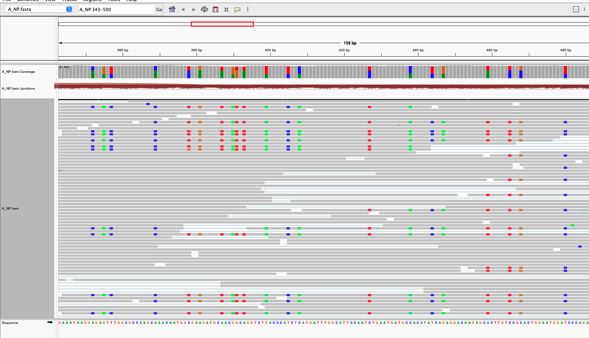
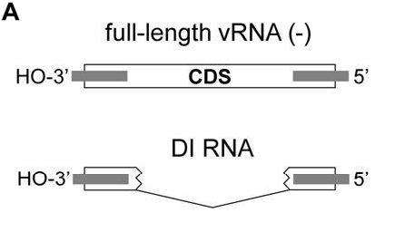
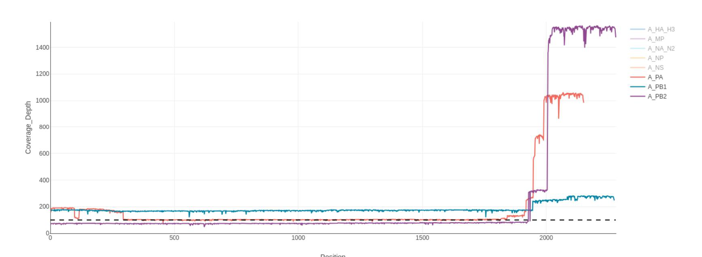
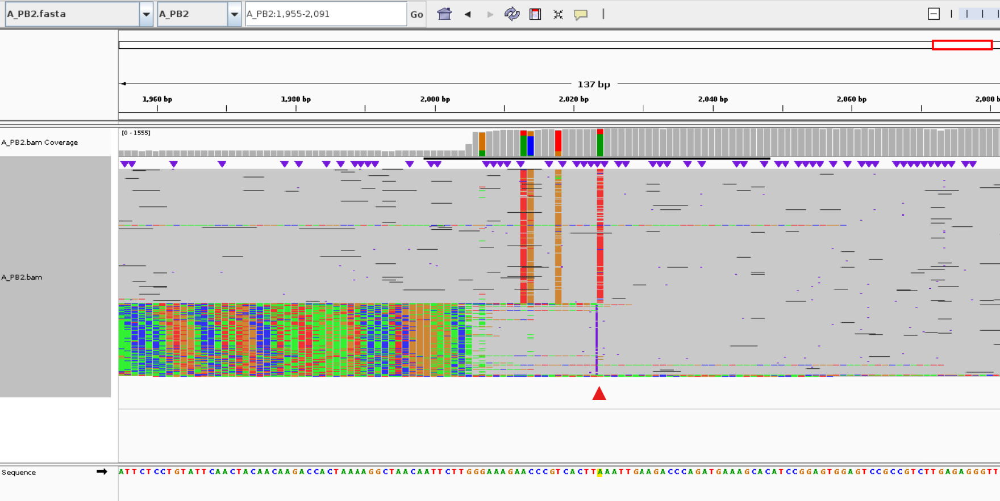
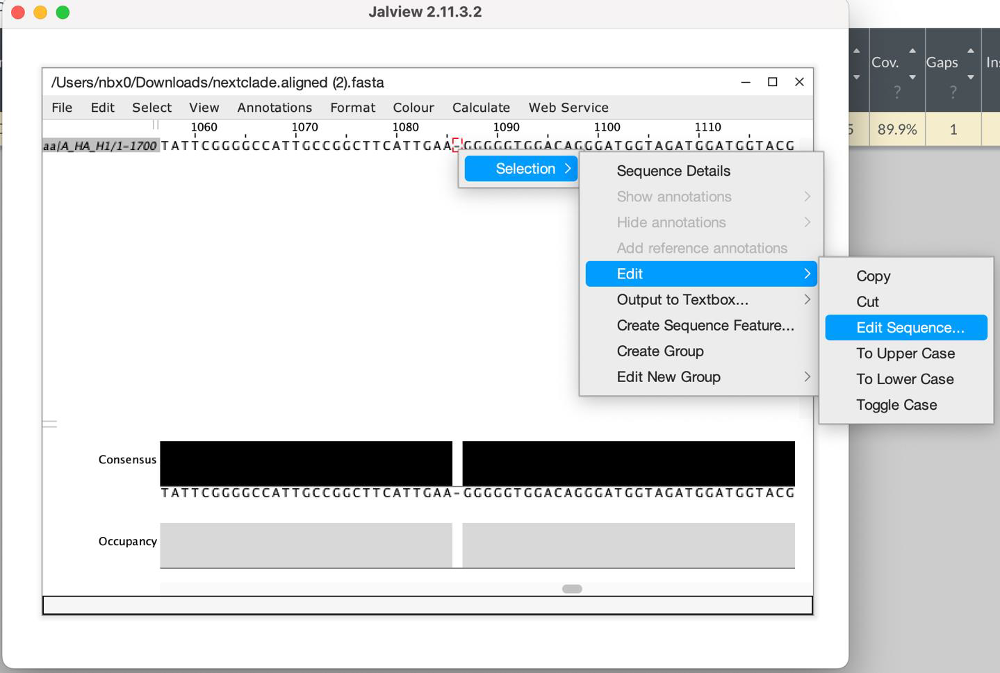

## Common Issues — Failed Mira QC

**Low-coverage / Incomplete segment coverage**

::: incremental
- **Not enough reads in your library** → *Back to the lab*
    - Ct ≤ 28?
    - Gel image resolves segment bands cleanly?
    - Proper sample number on your flow cell?
- **MIRA ≤ v2.0.0?**
    - Reads are being subsampled
:::

::: {.callout-tip}
A low Ct usually means more template — start your troubleshooting there before re-running the pipeline.
:::

## Common Issues — Failed Mira QC

**Minor variant count > 10**

::: incremental
- In standard **clinical** samples, we have never observed > 6 minor alleles (≥ 5% frequency); the majority have **1–3 per segment**
- **Cell cultures** regularly have high genetic variability which can result in high counts
- Could be a **co-infection** — an unlucky person got both H1N1 and H3N2 *at the same time*
- **Most likely contamination!**
:::

::: {.callout-warning}
A pattern of high minor-variant counts across **all** segments is a strong red flag for contamination.
:::

## Example: Per-segment QC results

::: qc-table
| sample_id | total_reads | reads_mapped | reference | % ref. cov. | median cov. | minor SNVs ≥ 5% | pass / fail reason |
|:---|---:|---:|:---|---:|---:|---:|:---|
| 95f48e8a | 95,828 | 10,388 | A_HA_H1 | 99.82 | 735 | 2 | **Pass** |
| 95f48e8a | 95,828 | 5,818 | A_MP | 100 | 686 | 148 | minor variants > 10 |
| 95f48e8a | 95,828 | 9,528 | A_NA_N1 | 99.79 | 814 | 3 | **Pass** |
| 95f48e8a | 95,828 | 9,146 | A_NP | 100 | 722 | 274 | minor variants > 10 |
| 95f48e8a | 95,828 | 5,704 | A_NS | 97.1 | 777 | 147 | minor variants > 10 |
| 95f48e8a | 95,828 | 11,790 | A_PA | 100 | 607 | 361 | minor variants > 10 |
| 95f48e8a | 95,828 | 13,230 | A_PB1 | 100 | 687 | 246 | minor variants > 10 |
| 95f48e8a | 95,828 | 12,175 | A_PB2 | 100 | 590 | 391 | minor variants > 10 |
| c282a097 | 16,170 | 1,992 | A_HA_H3 | 99.82 | 158 | 35 | minor variants > 10 |
| c282a097 | 16,170 | 1,382 | A_MP | 100 | 187 | 12 | minor variants > 10 |
| c282a097 | 16,170 | 1,852 | A_NA_N2 | 100 | 178 | 25 | minor variants > 10 |
| c282a097 | 16,170 | 1,720 | A_NP | 100 | 157 | 18 | minor variants > 10 |
| c282a097 | 16,170 | 1,336 | A_NS | 97.1 | 206 | 10 | **Pass** |
| c282a097 | 16,170 | 2,516 | A_PA | 100 | 148 | 22 | minor variants > 10 |
| c282a097 | 16,170 | 2,712 | A_PB1 | 100 | 161 | 23 | minor variants > 10 |
| c282a097 | 16,170 | 2,660 | A_PB2 | 100 | 160 | 28 | minor variants > 10 |
:::

::: footnotes
Two samples (`95f48e8a`, `c282a097`) — note how nearly every segment fails with *Count of minor variants at or over 5% > 10*. `pass_qc` column (= `total_reads`) omitted for clarity.
:::

## Two populations are present

:::::: columns
::: {.column width="34%"}
- One matching the **reference** (gray)
- One sharing **all the colored SNVs**

::: big-callout
**2+ mutations on one molecule are "phased" or "linked"**
:::

A clean bimodal signal across many reads strongly suggests **mixed populations / contamination**, not random sequencing error.
:::

::: {.column width="66%"}
{.clean-img fig-alt="IGV view of A_NP showing two read populations: a gray reference-matching set and a set sharing colored SNVs"}
:::
::::::

## Common Issues — Failed Mira QC

**Premature stop-codon?**

::: incremental
- **ONT homopolymer issue** — may require manual correction
- **DI particle–induced alignment** can create the same artifact
:::

::: {.callout-note}
Always inspect the alignment around the premature stop before discarding the segment — many premature stops are *fixable* artifacts, not biology.
:::

## DI Particles

:::::: columns
::: {.column width="60%"}
::: incremental
- DI Particles can **interfere with NGS**
- Common in **polymerase segments**
- Coverage shape can spike at the end — *"bat ears"*
- Can create **erroneous indel mutations** at coverage drop-off points
:::
:::

::: {.column width="40%"}
{.clean-img fig-alt="DI RNA schematic (full-length vRNA vs DI RNA)" style="max-height: 180px; width: auto;"}
:::
::::::

{.clean-img fig-alt="Coverage depth plot showing bat-ear spikes near segment ends" style="display:block; margin: 0.4em auto 0; max-width: 96%; max-height: 360px; width: auto;"}

::: footnotes
[Defective interfering particles — Biotechnology Journal, 2014](https://analyticalsciencejournals.onlinelibrary.wiley.com/doi/10.1002/biot.201400429)
:::

## DI Particles — Alignment View {.center-title}

{.fit-image fig-alt="IGV alignment of A_PB2 showing read pile-up and coverage dropoff with arrowed indel artifact caused by DI particles" fig-align="center"}

::: footnotes
Coverage drop-offs (red triangle) align with apparent indels — often a DI-particle artifact rather than a true mutation.
:::

## Frameshifts

:::::: columns
::: {.column width="44%"}
::: incremental
- **Prevalent in homopolymer regions** of Oxford Nanopore sequencing
- **DAIS-Ribosome is frameshift-tolerant**
    - Shows as a `~` mutation
- Convert back to nucleotide space and **add or remove a base** to fix
:::
:::

::: {.column width="56%"}
{.clean-img fig-alt="Jalview screenshot showing manual edit of homopolymer region in an HA alignment to correct a frameshift"}
:::
::::::

## Mira Demands High-Quality Results

::: incremental
- Together we can stop the **"Garbage In"** side of the data-analysis mantra: *"Garbage In, Garbage Out"*
- **Built-in thresholds** are for standardizing QC
- **Amended consensus** gives us extra information from a single sequence
    - A mixed site may be under **active or balancing selection** in the host
- Consider each **sample as a whole** — if HA and NA pass but all other segments fail, consider *why*
- **High-priority samples** can be useful even when QC thresholds are not met
:::

::: big-callout
Quality data in → quality decisions out. Every NIC matters.
:::

## Thank You {.center-title background-color="#003366"}

::: {style="text-align:center; color:#ffffff; font-size:1.1em;"}
**Questions & Discussion**

Ben Rambo-Martin, PhD  
Lead Bioinformatics Scientist  
US CDC — Influenza Division
:::
