##  {.disclaimer-slide}

:::: disclaimer-header
::: disclaimer-title
Disclaimer
:::
::::

The findings and conclusions in this presentation are those of the authors and do not necessarily represent the official position of the Centers for Disease Control and Prevention.

Use of trade names and commercial sources is for identification only and does not imply endorsement by the U.S. Department of Health and Human Services.

References to non-CDC sites on the Internet do not constitute or imply endorsement of these organizations or their programs by CDC or the U.S. Department of Health and Human Services. CDC is not responsible for the content of pages found at these sites.

{.disclaimer-art fig-alt="Disclaimer artwork: shield, lab, capitol, laptop globe, scales of justice, judge, code/web signpost"}

## Training Objectives {.training-objectives}

:::::: columns
:::: {.column width="55%"}
Trainees should be able to

::: incremental
-   Productionalize their influenza genomic data processing
-   Submit timely, high-quality data to GISAID and NCBI
-   Perform informatic analyses (e.g., phylogenetic trees, amino acid mutations) of influenza sequences
-   Generate genomic surveillance reports on circulating subtypes and clades
:::
::::

::: {.column width="45%"}
{.clean-img fig-alt="Training scene illustration"}
:::
::::::

## What is Influenza?

- RNA virus in the family **Orthomyxoviridae**
- Four types: **A, B, C, D** — Type A is the most clinically significant
- Causes seasonal epidemics and occasional pandemics
- Infects the respiratory tract; spreads via droplets and aerosols

::: {.callout-note}
Type A infects humans, birds, pigs, and more — giving it broad pandemic potential.
:::

## The Annual Global Burden of Influenza

::: {.columns}
::: {.column width="50%"}
**Morbidity & Mortality**

::: {.bigtable}
| Metric | Estimate |
|--------|----------|
| Total infections | ~1 billion/year |
| Severe illness cases | 3–5 million/year |
| Respiratory deaths | 290,000–650,000/year |
| US hospitalizations | 120,000–710,000/year |
| US deaths | 6,300–52,000/year |
:::

<small>WHO (2024); CDC (2025)</small>
:::
::: {.column width="50%"}
**Economic Impact (US)**

::: {.bigtable}
| Cost Category | Estimate |
|---------------|----------|
| Direct medical costs | ~$3.2–3.7 billion/year |
| Lost productivity | ~$8.0–16.3 billion/year |
| Total societal burden | up to ~$87 billion/year |
| 2023–24 season alone | ~$29 billion |
:::

<small>Molinari et al. (2007); Putri et al. (2018); GHLF/AVAC (2024)</small>
:::
:::

::: {.callout-warning}
**High-risk groups:** Adults ≥65 account for the majority of deaths — mortality rates are **26× higher** in this group than in those under 65. Burden is also disproportionately high in low- and middle-income countries, where 99% of severe influenza in children under 5 occurs.
:::

::: aside
**Sources:**
[WHO Influenza Fact Sheet](https://www.who.int/news-room/fact-sheets/detail/influenza-(seasonal)) ·
[CDC Flu Burden 2010–2025](https://www.cdc.gov/flu-burden/php/about/index.html) ·
[Paget et al., *J Glob Health* (2019) — GLaMOR Project](https://pmc.ncbi.nlm.nih.gov/articles/PMC6815659/) ·
[Molinari et al., *Vaccine* (2007)](https://pubmed.ncbi.nlm.nih.gov/17544181/) ·
[Putri et al., *Vaccine* (2018)](https://pubmed.ncbi.nlm.nih.gov/29801998/) ·
[GHLF/AVAC Cost of Illness Study (2026)](https://adultvaccinesnow.org/resources/influenzas-economic-burden-and-the-impact-of-adult-vaccination/)
:::

## Virion Structure

The influenza virion has three main layers:

::: {.bigtable}

| Layer | Components |
|-------|------------|
| **Envelope** | Lipid bilayer (host-derived); HA, NA, M2 surface proteins |
| **Matrix** | M1 protein shell beneath the envelope |
| **Core** | 8 RNA segments + nucleoprotein (NP) + polymerase (PB1, PB2, PA) |

:::

- **HA** — binds host cell receptors
- **NA** — releases new virions from the host cell
- **PB1/PB2/PA** — replicate and transcribe the viral genome

## The Genome

Influenza A carries **8 segments of negative-sense, single-stranded RNA**, each encoding key proteins:

::: {.bigtable}

| Segment | Key Protein | Role |
|---------|------------|------|
| 4 | **HA** | Attachment & membrane fusion |
| 6 | **NA** | Virion release (sialidase) |
| 1–3 | **PB2, PB1, PA** | RNA polymerase complex |
| 5 | NP | Encapsidates RNA |
| 7–8 | M1/M2, NS1/NEP | Matrix, ion channel, immune evasion |

:::

> Subtypes are named by HA & NA combination — e.g., **H1N1**, **H3N2**, **H5N1**

## ¿Why? {.why-slide background-color="#ffffff"}

{fig-alt="Why illustration in many languages" fig-align="center" height="600"}

## Influenza mutates rapidly (drifts) and evades previous host immunity

:::::: columns
::: {.column width="68%"}
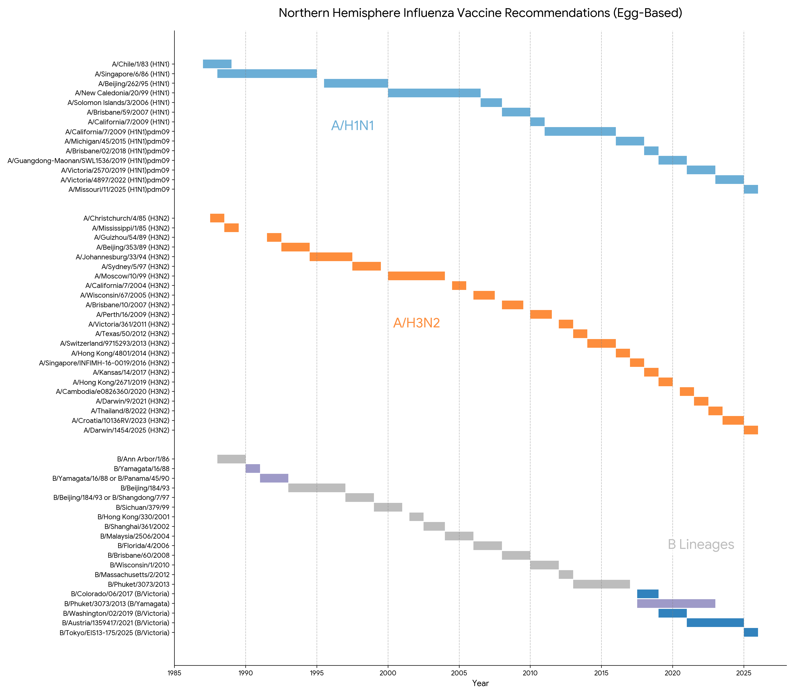{.drift-img fig-alt="Antigenic drift figure"}
:::

:::: {.column width="32%"}
::: big-callout
**Vaccine antigen must be updated most years**
:::
::::
::::::

## Genetic Change: Drift vs. Shift

::: {.columns}
::: {.column width="50%"}
**Antigenic Drift** 🚣

- Gradual point mutations in HA/NA
- Error-prone polymerase (no proofreading)
- Slow immune evasion over time
- Reason flu vaccines are updated **annually**
:::
::: {.column width="50%"}
**Antigenic Shift** 💥 🔀

- Sudden swap of whole gene segments (**reassortment**)
- Happens when two strains infect the **same cell**
- Can trigger **pandemics** (e.g., 2009 H1N1)
:::
:::

## Vaccine strain is chosen \~8 months before flu season

:::::: columns
:::: {.column width="50%"}
-   **WHO** convenes technical consultations to recommend viruses for three components:
    -   A(H1N1)pdm09, A(H3N2) and B/Victoria lineage
-   Two recommendation tracks:
    -   Egg-based vaccines
    -   Cell / recombinant / nucleic acid–based vaccines
-   Prototype names may differ by platform — both represent the best candidate for subtype

::: {.callout-tip title="Timing of Influenza Vaccine Recommendations" appearance="simple"}
**6–8 months** for the production, regulatory approval and distribution of the manufactured vaccines
:::
::::

::: {.column width="50%"}
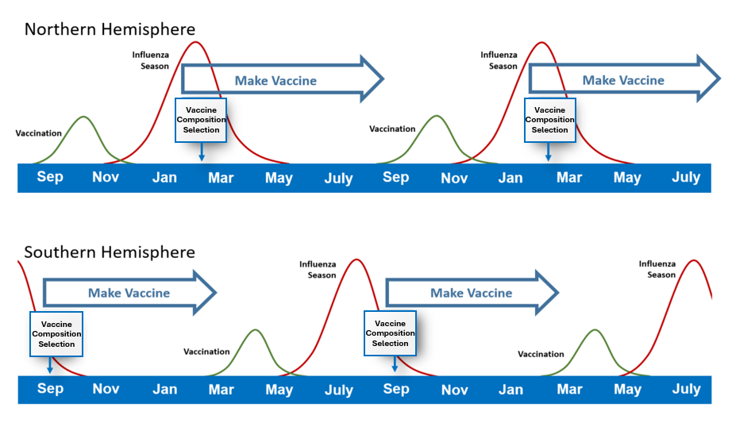{.clean-img fig-alt="Vaccine strain selection timing diagram"}
:::
::::::

## Influenza Vaccine Composition Meeting Decision Process {.vcm-overview}

::: vcm-goal
**Goal** — Identify antigens that elicit immunity against diverse / diverging future viruses
:::

:::::::: vcm-grid
::: vcm-col
**Review influenza activity, trends, geography**

*Epidemiologic and clinical data*

-   Where are recent epidemics occurring
-   Virus surveillance

*Global Influenza Surveillance and Response System (GISRS) labs test 50–150 thousand samples per week year-round: identify influenza positive specimens; type and influenza A subtype*
:::

::: vcm-col
**Review laboratory data of recently collected viruses**

*Genomic Characterization*

-   Genetic subclades that have emerged; geographic spread and proportion; forecasting predominance

*Antigenic Characterization*

-   Level of antigenic drift from progenitors and/or vaccine references
:::

::: vcm-col
**Data Sharing and Integration across GISRS**

-   Genetic and Antigenic data integration
-   Phylogenetics
-   Phylogeography
-   Fitness forecasting
-   Antigenic cartography
-   Antiviral susceptibility
-   Human Serum Panels
-   Candidate Vaccine Virus (CVV) Reagent sharing
:::

::: vcm-col
**Human serology data and vaccine effectiveness**

*Post-vaccination and post-exposure studies*

-   Comparative analysis of co-circulating antigenic variants to identify those that pose the greatest risk of immune escape

*Global Influenza Vaccine Effectiveness (GIVE) Collaboration: VE studies — previous and current season interim results*
:::

::: vcm-col
**Review Candidate Vaccine Virus availability**

*New CVVs*

-   Analysis of the availability and characterization status of candidate vaccine viruses for each platform
-   Review of cell or egg-adaptation mutations in CVVs
-   Review of high-growth reassortants
:::
::::::::

::: footnotes
[VCM FAQ — WHO](https://cdn.who.int/media/docs/default-source/vcm-northern-hemisphere-recommendation-2026-2027/b.-27-feb-2026-frequently-asked-questions.pdf?sfvrsn=66208818_7) · Russell, C.A. et al., *Vaccine* (2008) [doi.org/10.1016/j.vaccine.2008.07.078](https://doi.org/10.1016/j.vaccine.2008.07.078)

*Slide credit and thanks to Dr. Becky Kondor*
:::

## It all begins with **YOU!** {.center-title}

{fig-alt="Global health workers and laboratories" fig-align="center"}

## Global Influenza Surveillance and Response System (GISRS) {.center-title}

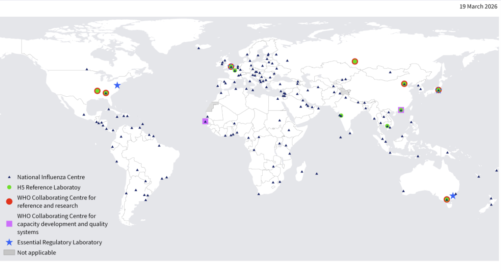{.clean-img fig-alt="GISRS network world map" fig-align="center" height="560"}

::: notes
National Influenza Centers perform sentinel surveillance to feed System.
:::

## Influenza Vaccine Composition Meeting Decision Process {.vcm-overview}

::: vcm-goal
**Goal** — Identify antigens that elicit immunity against diverse / diverging future viruses
:::

:::::::: vcm-grid
::: {.vcm-col .vcm-highlight}
**Review influenza activity, trends, geography**

*Epidemiologic and clinical data*

-   Where are recent epidemics occurring
-   Virus surveillance — GISRS labs test 50–150 thousand samples per week year-round: identify positives; type and subtype
:::

::: {.vcm-col .vcm-dim}
**Review laboratory data**
:::

::: {.vcm-col .vcm-dim}
**Data Sharing & Integration across GISRS**
:::

::: {.vcm-col .vcm-dim}
**Human serology and vaccine effectiveness**
:::

::: {.vcm-col .vcm-dim}
**Review CVV availability**
:::
::::::::

::: footnotes
*Slide credit and thanks to Dr. Becky Kondor*
:::

## Global Circulation of Seasonal Influenza Viruses Since January 2024

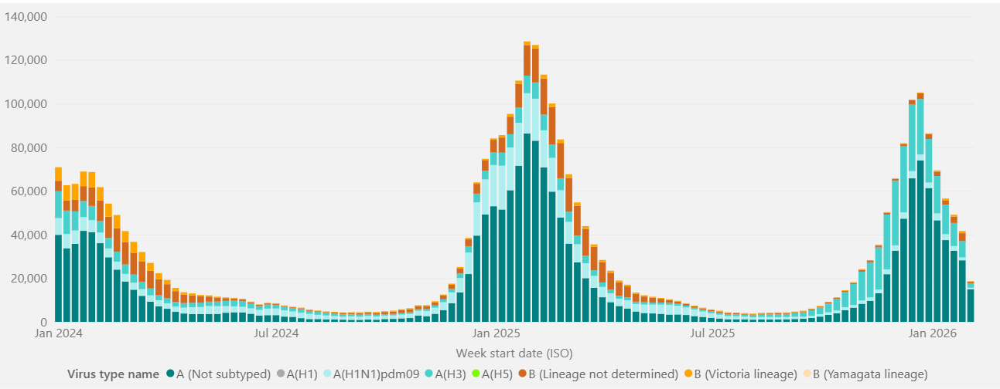{fig-alt="Global circulation of seasonal influenza viruses since Jan 2024" fig-align="center" height="540"}

::: footnotes
Data reported to FluNet by GISRS National Influenza Centers in 135 member states · [VCM Information meeting](https://www.youtube.com/@who)
:::

## Influenza activity and global distribution of type/subtype

::: subtitle-line
**September 1, 2025 — January 31, 2026**
:::

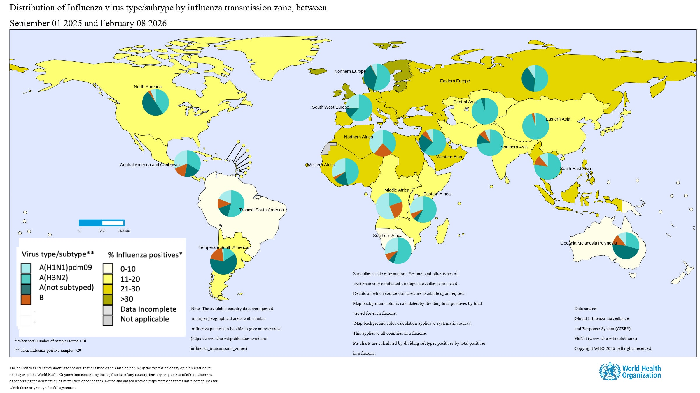{.clean-img fig-alt="Influenza activity & subtype global distribution map"}

::: footnotes
[VCM Information meeting](https://www.youtube.com/@who)
:::

## Your data is leading to more refined definitions of "influenza season" {.smaller}

::::::: grid-2x2
::: cell
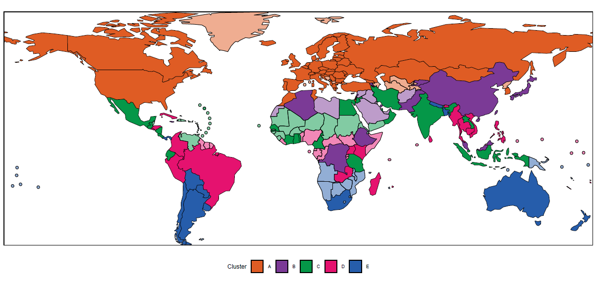
:::

::: cell
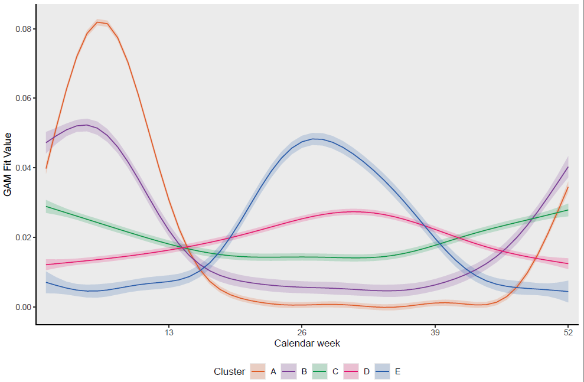
:::

::: cell
-   **A** — northern hemisphere pattern; peak influenza activity between October–April
-   **B** — northern hemisphere pattern; peak influenza activity between September–March
-   **C** — tropics; influenza activity between September–March
-   **D** — southern hemisphere pattern; influenza activity between May–November; additional activity in other months
-   **E** — southern hemisphere pattern; peak influenza activity between May–November
:::

::: cell
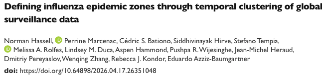
:::
:::::::

::: footnotes
[medRxiv link](https://www.medrxiv.org/content/10.64898/2026.04.17.26351048v1)
:::

::: notes
2011‒2024 by 180 countries GISRS data (except 2020–2023).  computed generalized additive models (GAMs) of each country’s weekly influenza-positive tests to smooth and impute time series distributions. From these GAMs, we calculated each country’s normalized weekly influenza burden.

Epidemic zones may serve as a useful tool to strengthen and optimize influenza surveillance for global health decision-making (e.g., during vaccine strain composition discussions) and to guide country preparedness efforts for seasonal influenza epidemics, including the timing of enhanced surveillance, as well as the procurement and delivery of vaccines and antivirals.
:::

## Influenza Vaccine Composition Meeting Decision Process {.vcm-overview}

::: vcm-goal
**Goal** — Identify antigens that elicit immunity against diverse / diverging future viruses
:::

:::::::: vcm-grid
::: {.vcm-col .vcm-dim}
**Review influenza activity, trends, geography**
:::

::: {.vcm-col .vcm-highlight}
**Review laboratory data of recently collected viruses**

*Genomic Characterization* — genetic subclades that have emerged; geographic spread and proportion; forecasting predominance

*Antigenic Characterization* — level of antigenic drift from progenitors and/or vaccine references
:::

::: {.vcm-col .vcm-dim}
**Data Sharing & Integration across GISRS**
:::

::: {.vcm-col .vcm-dim}
**Human serology and vaccine effectiveness**
:::

::: {.vcm-col .vcm-dim}
**Review CVV availability**
:::
::::::::

::: footnotes
*Slide credit and thanks to Dr. Becky Kondor*
:::

## Genomic Surveillance: Nomenclature for Hemagglutinin (HA) and Neuraminidase (NA) {.smaller}

:::::: columns
::: {.column width="58%"}
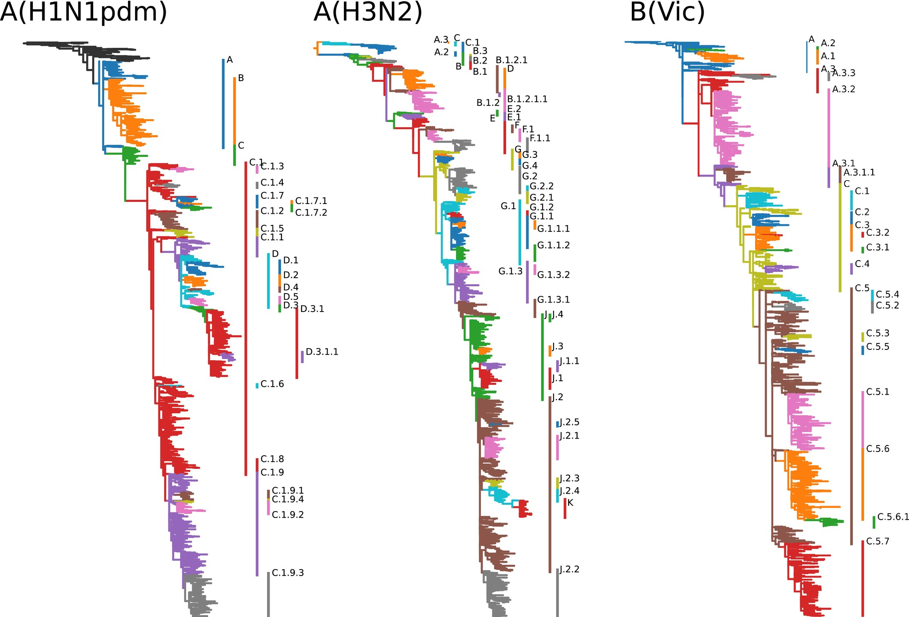{.clean-img fig-alt="HA and NA nomenclature phylogenetic tree"}
:::

:::: {.column width="42%"}
**Goal:** Tracking of relative frequencies of co-circulating subclades

::: criteria-box
**Criteria for Subclade Definition:**

-   **Size and dynamics** of the subclade — larger, recently expanded groups prioritized
-   **Divergence** — more genetic changes since the parent group given higher priority
-   **Specific amino acid substitutions** — significant substitutions that may affect phenotype
:::

-   New subclade and aliases about **four times a year** — usually after VCM
::::
::::::

::: footnotes
*Influenza Resp Viruses* 20(2), 13 Feb 2026 · DOI [10.1111/irv.70230](https://doi.org/10.1111/irv.70230) · [clades.nextstrain.org](https://clades.nextstrain.org/) · *Slide credit: Dr. Becky Kondor*
:::

## A(H3N2) Viruses in the 25/26 Northern Hemisphere {.section-divider background-color="#003366"}

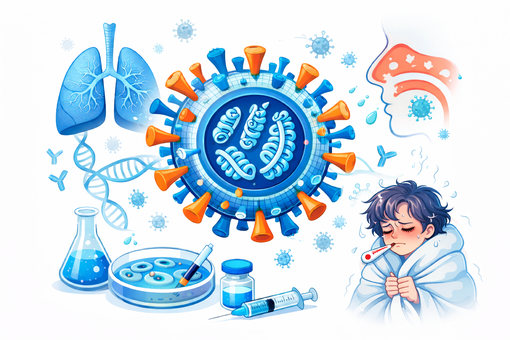{.section-divider-img fig-alt="A(H3N2) section divider artwork" fig-align="center"}

## Number of A(H3N2) viruses detected by GISRS

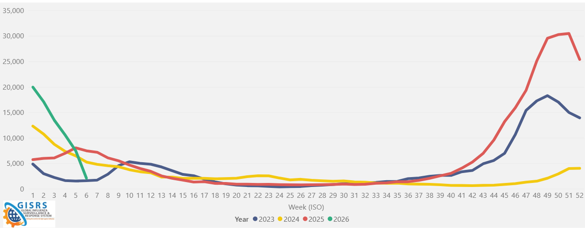{.fit-image fig-alt="Number of A(H3N2) viruses detected by GISRS over time" fig-align="center"}

::: footnotes
[VCM Information meeting](https://www.youtube.com/@who)
:::

::: notes
This graph shows the number of A(H3N2) viruses detected between epidemiological week 1 of 2023 through epidemiological week 6 of 2026. The blue line represents 2023, the yellow line represents 2024, the red line represents 2025,and the green line represents 2026. For the current reporting period of September 1, 2025 to January 31, 2026, A(H3N2) detections were substantially higher compared to the same time period for previous years and substantially higher compared to the 2024-2025 northern hemisphere influenza season.
:::

## Influenza A(H3N2) virus activity

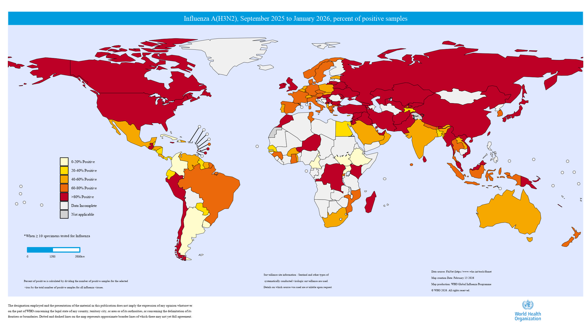{.fit-image fig-alt="A(H3N2) virus activity global map and chart" fig-align="center"}

::: footnotes
Data source: [FluNet](https://www.who.int/tools/flunet), Global Influenza Surveillance and Response System (13 February 2026) · [VCM Information meeting](https://www.youtube.com/@who)
:::

::: notes
This graphic shows a world map of the distribution of A(H3N2) virus detections based on % H3 positive of influenza positive specimens tested between September 1, 2025 and January 31, 2025. Significant A(H3N2) activity (>40% positivity) was observed in all regions.
:::

## A(H3N2) HA phylogeography

::::: columns
::: {.column width="78%"}
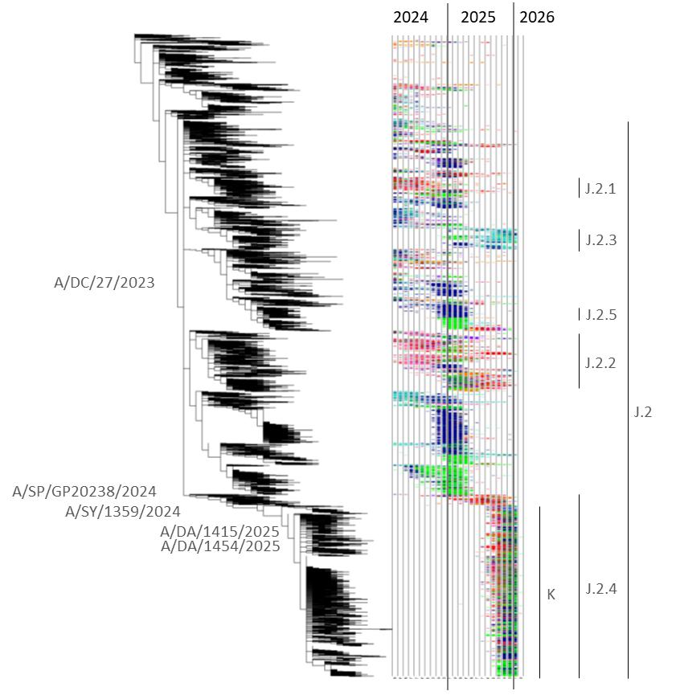{.fit-image-col fig-alt="A(H3N2) HA phylogeography tree colored by region"}
:::

::: {.column width="22%"}
**Region**

-    North America
-    South America
-    Europe
-    Africa
-    Middle East
-    Russia
-    E / SE Asia
-    Oceania

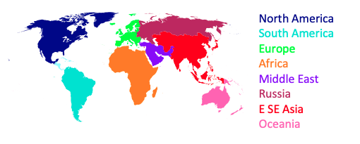
:::
:::::

::: footnotes
Figure source: University of Cambridge · [clades.nextstrain.org](https://clades.nextstrain.org/) · [VCM Information Meeting](https://www.youtube.com/watch?v=JMMfQVf9rco) · *Slide credit: Dr. Becky Kondor*
:::

::: notes
The image shown is of a phylogeographic analysis of the A(H3N2) HA gene. A(H3N2) viruses were detected in all in all geographic regions, with regional differences in proportions and continued genetic diversification. Phylogenetic analysis of the HA gene of A(H3N2) viruses showed that the vast majority of viruses circulating in 2024 to present belonged to HA subclade J.2. There was further diversification of the J.2 subclade to include J.2.1, J.2.3, J.2.5, J.2.2, J.2.4, and K which was formerly designated as J.2.4.1. The recommended A(H3N2) vaccine antigens belong to the K subclade.
:::

## Global A(H3N2) HA clade diversity: Sep 2025 to Jan 2026

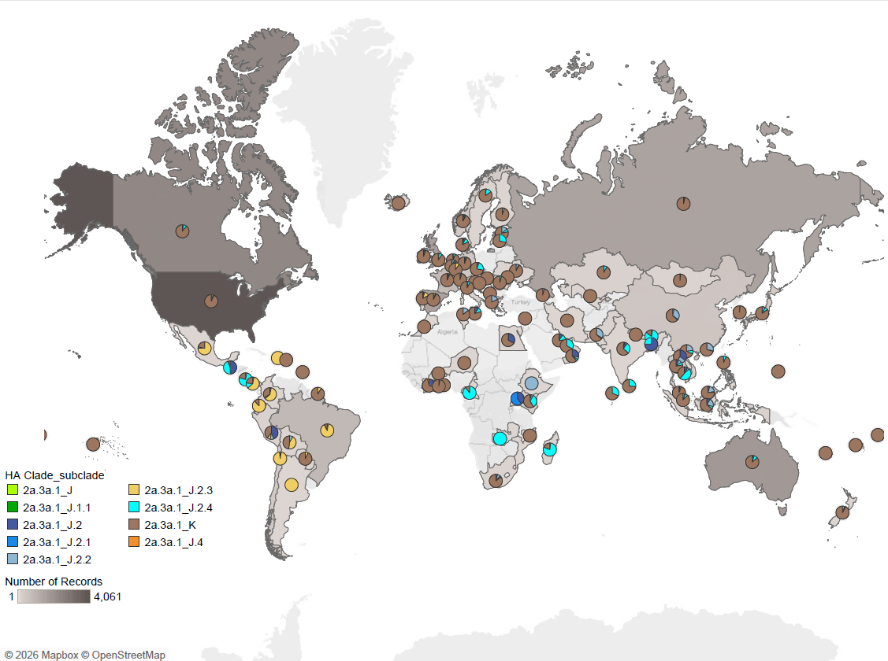{.fit-image fig-alt="Global A(H3N2) HA clade diversity by region donut charts" fig-align="center"}

::: footnotes
Data source: [clades.nextstrain.org](https://clades.nextstrain.org/) · *Slide credit: Dr. Becky Kondor*
:::

::: notes
This graphic shows a world map of the distribution of A(H3N2) virus detections based on HA subclades with specimen collection dates between September 2025 and January 2026. 
Viruses belonging to HA subclade K predominated in most regions, although viruses belonging to subclade J.2.3 predominated in Central and South America and viruses belonging to subclade J.2.4 predominated in parts of Southern Africa.
:::

## A(H3N2) Extended Diversity Plot — Global view {.smaller}

::: subtitle-line
**Feb 2025 – Jan 2026**
:::

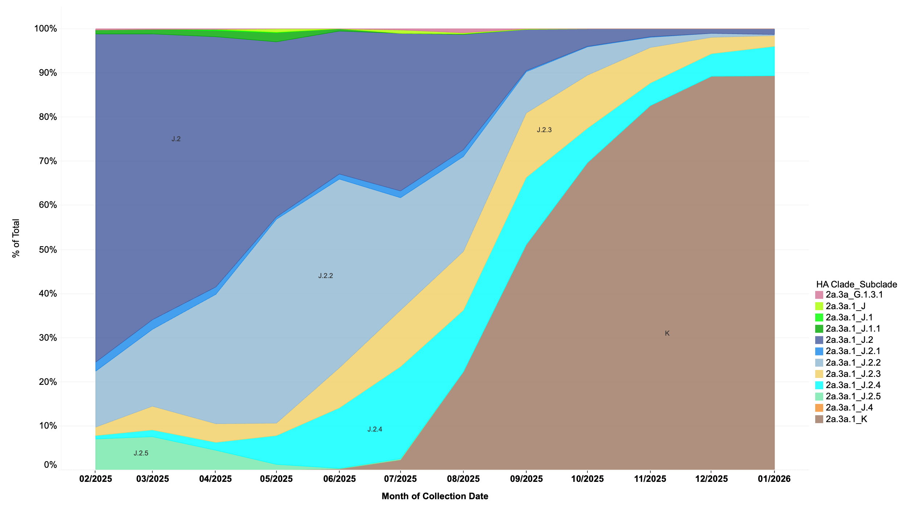{.fit-image fig-alt="A(H3N2) extended diversity plot global view" fig-align="center"}

::: footnotes
Data source:  · [clades.nextstrain.org](https://clades.nextstrain.org/) · *Slide credit: Dr. Becky Kondor*
:::

::: notes
The graphic on the left shows an extended diversity plot of the influenza A(H3N2) clades and subclades globally from February 1, 2025 to present. The vast majority of viruses belonged to clade 2a.3a.1 and viruses belonging to the J.2 subclades predominated globally. At the start of this reporting period, viruses belonging to subclade J.2 predominated although viruses belonging to subclade J.2.2, J.2.3, J.2.4, and J.2.5 co-circulated. Since June 2025, detections of viruses belonging to the K subclade increased, and viruses belonging to subclade K have predominated in recent months. Viruses belonging to subclades J.2, J.2.3, and J.2.4 continue to co-circulate but at much lower levels. 

The graphic on the right shows an extended diversity plot of the influenza A(H3N2) clades and subclades in the United States from September 20, 2025 to present. All viruses belonged to clade 2a.3a.1, and viruses belonging to subclade K predominated throughout the reporting period. Viruses belonging to subclades J.2.3 and J.2.4 continue to co-circulate but at much lower levels.
:::

## A(H3N2) Extended Diversity Plot by Geographic Region {.smaller}

:::::: columns
:::: {.column width="25%"}
**February 2025 – February 2026**

**HA Clade_Subclade**

::: subclade-legend
-    2a.3a_G.1.3.1
-    2a.3a1_J
-    2a.3a1_J.1
-    2a.3a1_J.1.1
-    2a.3a1_J.2
-    2a.3a1_J.2.1
-    2a.3a1_J.2.2
-    2a.3a1_J.2.3
-    2a.3a1_J.2.4
-    2a.3a1_J.2.5
-    2a.3a1_J.4
-    2a.3a1_K
:::
::::

::: {.column width="75%"}
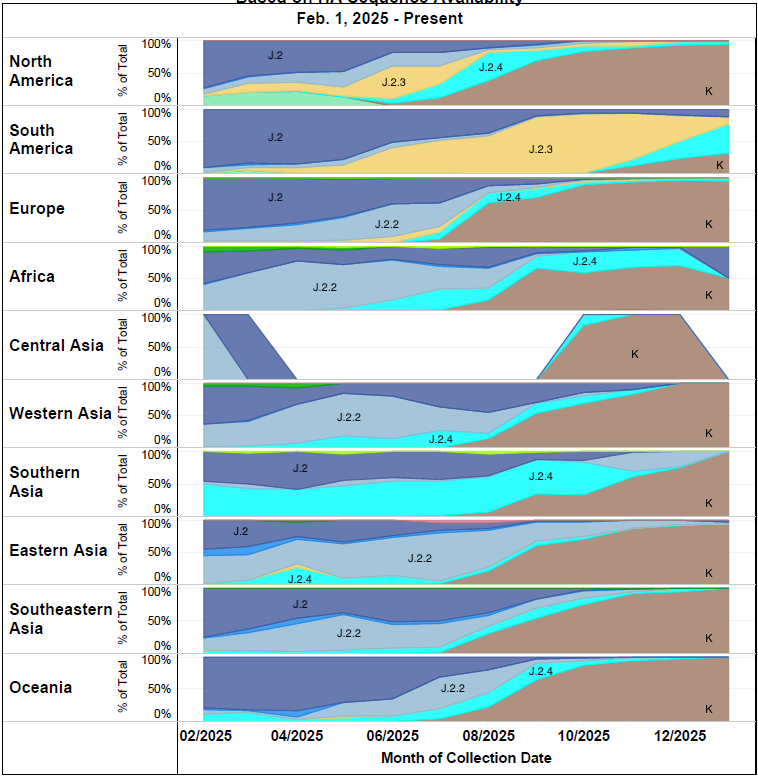{.fit-image-col fig-alt="A(H3N2) extended diversity plot stacked by geographic region"}
:::
::::::

::: footnotes
Data source:  · [clades.nextstrain.org](https://clades.nextstrain.org/) · *Slide credit: Dr. Becky Kondor*
:::

::: notes
This graphic shows an extended diversity plot of the influenza A(H3N2) clades and subclades by geographic region, from February 1, 2025 to present. The vast majority of viruses belonged to clade 2a.3a.1 and viruses belonging to the J.2 subclades predominated globally. Detections of viruses belonging to the K subclade increased during this reporting period and were predominant in all regions in recent months, except for South America where viruses belonging to J.2, J.2.3, J.2.4, and K co-circulated at varying proportions and in Africa where viruses belonging to J.2 and K co-circulated at equal proportions.
:::

## Influenza phenotyping relies heavily on ferrets and hemagglutinin inhibition assays {.center-title}

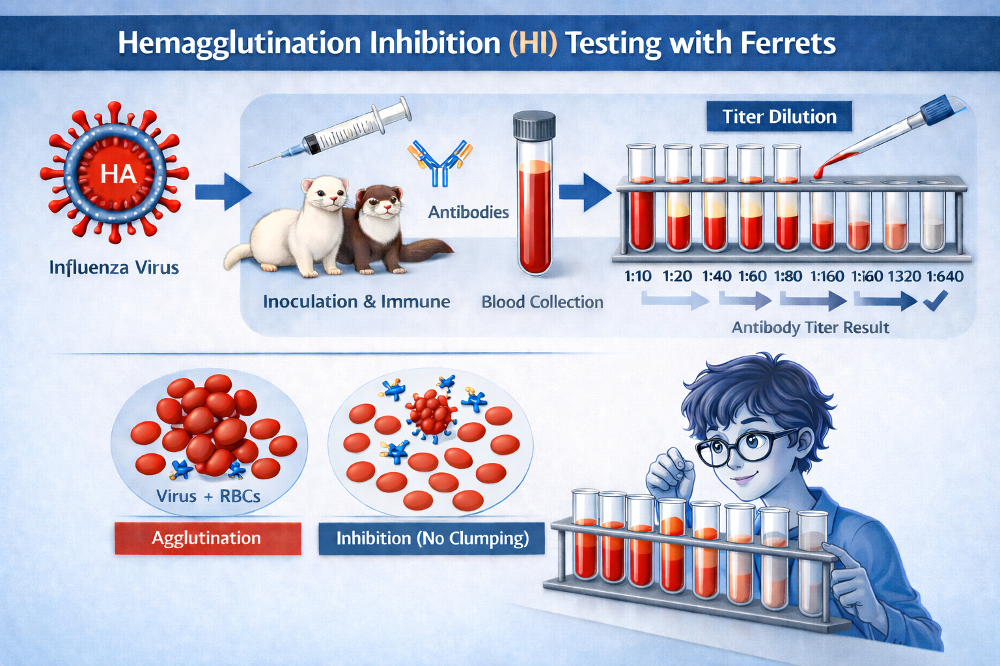{.clean-img fig-alt="Ferret HI assay illustration" fig-align="center" style="max-height: 560px; max-width: 100%; width: auto; height: auto; object-fit: contain;"}

## HI antigenic analysis of A(H3N2) viruses {.hi-table-slide}

::: hi-table
|   | Cell Cro/10136RV | Cell Neth/10685 | Cell Syd/1359 | Egg Sing/GP20238 | Cell Dar/1415 | Egg Dar/1454 |
|:----------|:---------:|:---------:|:---------:|:---------:|:---------:|:---------:|
| **HA subclade** | J.2 | J.2.3 | J.2.4 | J.2.4 | K | K |
| ***Reference virus*** |  |  |  |  |  |  |
| A/Croatia/10136RV/2023 (J.2) | 320 | \<40 | 40 | 40 | \<40 | \<40 |
| A/Netherlands/10685/2024 (J.2.3) | 80 | 640 | \<40 | \<40 | \<40 | \<40 |
| A/Sydney/1359/2024 (J.2.4) | 160 | 40 | 320 | 2560 | 640 | 640 |
| A/Singapore/GP20238/2024 (J.2.4) | 160 | 160 | 640 | 2560 | 320 | 320 |
| A/Darwin/1415/2025 (K) | 40 | 40 | 160 | 640 | 640 | 640 |
| A/Darwin/1454/2025 (K) | \<40 | 80 | 320 | 1280 | 1280 | 640 |
| ***Test virus*** |  |  |  |  |  |  |
| A/Darwin/2100/2025 (J.2.2) | 320 | \<40 | 40 | 40 | \<40 | \<40 |
| A/Singapore/GP14404/2025 (J.2.2) | 320 | \<40 | 40 | 40 | \<40 | \<40 |
| A/Victoria/2797/2025 (J.2.4) | \<40 | \<40 | 320 | 640 | 640 | 640 |
| A/Sri Lanka/69/2025 (J.2.4) | 80 | 40 | 320 | 2560 | 640 | 640 |
| A/Tasmania/1035/2025 (K) | \<40 | \<40 | 80 | 320 | 320 | 320 |
| A/Canberra/980/2025 (K) | \<40 | \<40 | 80 | 640 | 640 | 320 |
| A/Sri Lanka/111/2025 (K) | 40 | \<40 | 160 | 640 | 1280 | 1280 |
| A/Cambodia/IKCM250152/2025 (K) | \<40 | \<40 | 160 | 640 | 640 | 320 |
| A/New Caledonia/195/2025 (K) | \<40 | \<40 | 80 | 640 | 640 | 640 |
| A/Nepal/S3684/2025 (K) | \<40 | \<40 | 80 | 320 | 640 | 640 |
:::

::: footnotes
Source: WHO CC, Australia · [VCM Information meeting](https://www.youtube.com/@who) · *Slide credit and thanks to Dr. Becky Kondor*
:::

## A(H3N2) antigenic cartography {.smaller}

::::: columns
::: {.column width="50%"}
**A(H3N2) — CDC Atlanta (HINT)**\
A/Darwin/1415/2025-cell-like serum circle (within 8-fold of homologous titer)

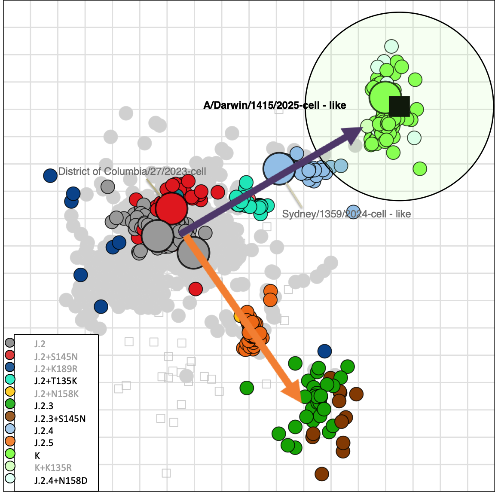{.clean-img fig-alt="A(H3N2) antigenic cartography - CDC Atlanta HINT" style="max-height: 480px; max-width: 100%; width: auto; height: auto; object-fit: contain;"}
:::

::: {.column width="50%"}
**A(H3N2) — CC Tokyo (HI)**\
A/Darwin/1454/2025-egg-like serum circle (within 8-fold of homologous titer)

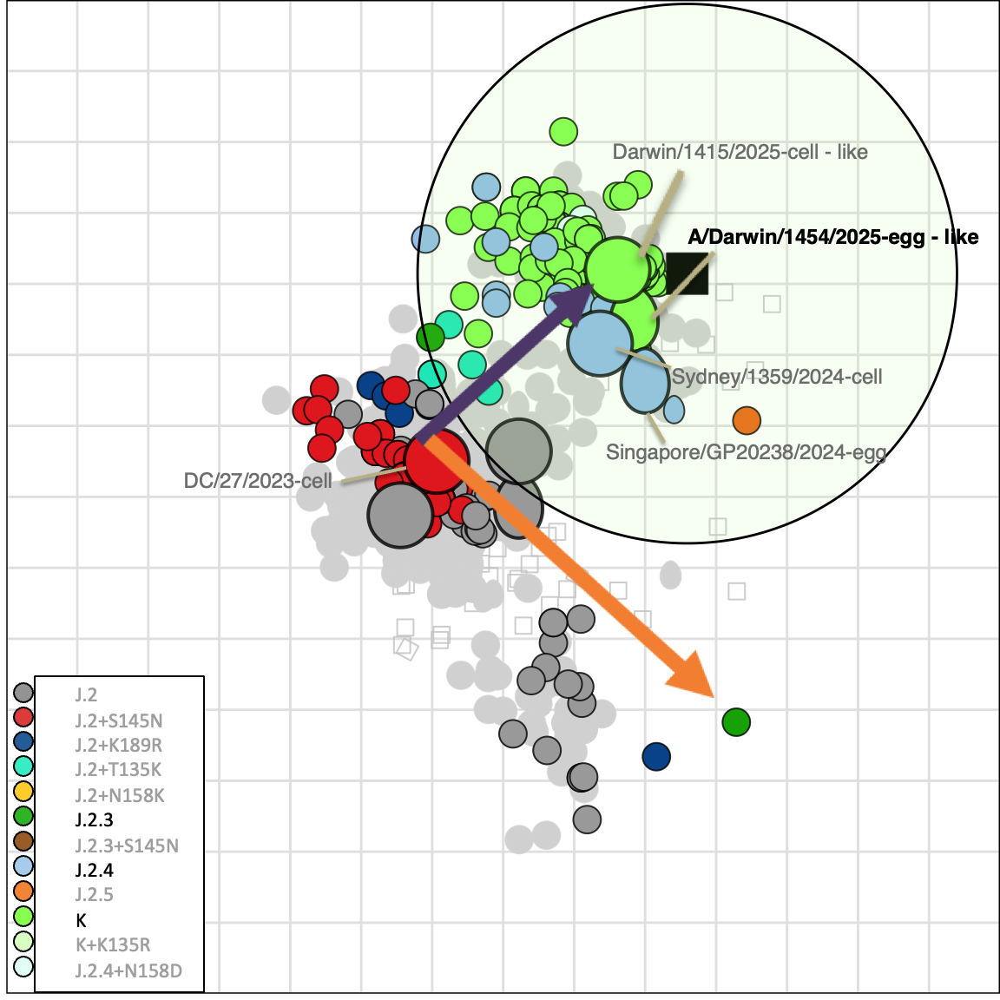{.clean-img fig-alt="A(H3N2) antigenic cartography - CC Tokyo HI" style="max-height: 480px; max-width: 100%; width: auto; height: auto; object-fit: contain;"}
:::
:::::

::: footnotes
Source: University of Cambridge · [VCM Information meeting](https://www.youtube.com/@who) · *Slide credit and thanks to Dr. Becky Kondor*
:::

::: notes
The images shown are of antigenic relationships of A(H3N2) viruses tested in virus neutralization and hemagglutination inhibition assays at CDC and the WHO Collaborating Center in Tokyo. The antigenic cartography maps show that recently circulating J.2 viruses with additional amino acid changes in the HA (belonging to subclades J.2.3, J.2.4, J.2.5, and K) are clustering farther apart from the 2025-2026 northern hemisphere vaccine reference viruses indicating antigenic drift. The image on the left represents viruses tested in virus neutralization assays at CDC. The image on the right represents viruses tested in hemagglutination inhibition assays at the WHO Collaborating Center in Tokyo. The image on the left shows that the serum circle for post-infection ferret antisera raised against cell-propagated A/Darwin/1415/2025 recognized other K viruses well (within 8-fold homologous titers). The image on the right shows that the serum circle for post-infection ferret antisera raised against egg-propagated A/Darwin/1454/2025 recognized other K viruses well and shows cross reactivity with recent viruses belonging to some HA subclades, including J.2.4 and J.2 with the T135K amino acid change (withing 8-fold homologous titers).
:::

## Antigenic analysis of A(H3N2) viruses in HI and NT assays

::: subtitle-line
**Antisera to northern hemisphere 2025–2026 vaccine virus antigens**
:::

::::::: columns
:::: {.column width="50%"}
**A/District of Columbia/27/2023-like Cell**\
2a.3a.1 (J.2) by HI

| WHO CC    |      Like      | Low (≥ 8 fold) |
|:----------|:--------------:|:--------------:|
| CDC       |    19 (9%)     |   202 (91%)    |
| CNIC      |   946 (43%)    |   1231 (57%)   |
| FCI       |    46 (18%)    |   216 (82%)    |
| NIID      |    33 (11%)    |   260 (89%)    |
| VIDRL     |    124 (9%)    |   1329 (91%)   |
| **Total** | **1168 (27%)** | **3238 (73%)** |

::: orange-table
**A/District of Columbia/27/2023-like Cell**\
2a.3a.1 (J.2) by NT

| WHO CC    |     Like     |      Low      |
|:----------|:------------:|:-------------:|
| CDC       |   14 (12%)   |   104 (88%)   |
| FCI       |   23 (26%)   |   64 (74%)    |
| **Total** | **37 (18%)** | **168 (82%)** |
:::
::::

:::: {.column width="50%"}
**A/Croatia/10136RV/2023-like Egg**\
2a.3a.1 (J.2) by HI

| WHO CC    |     Like      | Low (≥ 8 fold) |
|:----------|:-------------:|:--------------:|
| CDC       |    8 (4%)     |   213 (96%)    |
| CNIC      |   520 (24%)   |   1657 (76%)   |
| FCI       |    20 (8%)    |   242 (92%)    |
| NIID      |    8 (3%)     |   285 (97%)    |
| VIDRL     |    47 (3%)    |   1406 (97%)   |
| **Total** | **603 (14%)** | **3803 (86%)** |

::: orange-table
**A/Croatia/10136RV/2023-like Egg**\
2a.3a.1 (J.2) by NT

| WHO CC    |     Like     |     Low      |
|:----------|:------------:|:------------:|
| FCI       |   15 (25%)   |   46 (75%)   |
| **Total** | **15 (25%)** | **46 (75%)** |
:::
::::
:::::::

::: footnotes
"Low" represented titers ≥ 8-fold lower than vaccine strain homologous titer · [VCM Information meeting](https://www.youtube.com/@who) · *Slide credit: Dr. Becky Kondor*
:::

## Antigenic analysis of A(H3N2) viruses in HI and VN assays

::: subtitle-line
**Antisera to southern hemisphere 2026 vaccine virus antigens**
:::

::::::: columns
::: {.column width="50%"}
**A/Sydney/1359/2024-like Cell**\
2a.3a.1 (J.2.4) by HI

| WHO CC    |      Like      | Low (≥ 8 fold) |
|:----------|:--------------:|:--------------:|
| CDC       |   167 (76%)    |    54 (24%)    |
| CNIC      |   405 (72%)    |   154 (28%)    |
| FCI       |   102 (39%)    |   160 (61%)    |
| NIID      |   207 (92%)    |    18 (8%)     |
| VIDRL     |   1274 (88%)   |   179 (12%)    |
| **Total** | **2155 (79%)** | **565 (21%)**  |

**A/Sydney/1359/2024-like Cell**\
2a.3a.1 (J.2.4) by VN

| WHO CC    |     Like      |     Low      |
|:----------|:-------------:|:------------:|
| CDC       |   96 (81%)    |   22 (19%)   |
| FCI       |   73 (84%)    |   14 (16%)   |
| **Total** | **169 (82%)** | **36 (18%)** |
:::

::::: {.column width="50%"}
::: orange-table
**A/Singapore/GP20238/2024-like Egg**\
2a.3a.1 (J.2.4) by HI

| WHO CC    |      Like      | Low (≥ 8 fold) |
|:----------|:--------------:|:--------------:|
| CDC       |   110 (85%)    |    19 (15%)    |
| CNIC      |   368 (22%)    |   1279 (78%)   |
| FCI       |   115 (44%)    |   147 (56%)    |
| NIID      |   198 (88%)    |    27 (12%)    |
| VIDRL     |   1184 (81%)   |   269 (19%)    |
| **Total** | **1975 (53%)** | **1741 (47%)** |
:::

::: orange-table
**A/Singapore/GP20238/2024-like Egg**\
2a.3a.1 (J.2.4) by VN

| WHO CC    |     Like     |     Low      |
|:----------|:------------:|:------------:|
| FCI       |   11 (13%)   |   76 (87%)   |
| **Total** | **11 (13%)** | **76 (87%)** |
:::
:::::
:::::::

::: footnotes
"Low" represented titers ≥ 8-fold lower than vaccine strain homologous titer · [VCM Information meeting](https://www.youtube.com/@who) · *Slide credit: Dr. Becky Kondor*
:::

## Human post-vaccination serum analysis of A(H3N2) viruses (CDC data)

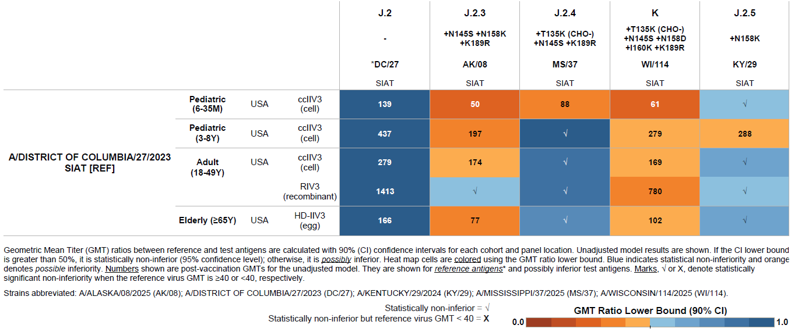{.clean-img fig-alt="Human post-vaccination serum analysis CDC data" fig-align="center" height="540"}

::: footnotes
*Slide credit and thanks to Dr. Becky Kondor*
:::

::: notes
This graphic shows serology testing performed by CDC of sera from people immunized with the Northern Hemisphere 2025-2026 influenza vaccine across egg, cell, and recombinant vaccine platforms. Human serology with post-vaccination serum panels showed that when compared to the geometric mean titers (GMTs) of MDCK-SIAT1-propagated vaccine reference virus A/District Of Columbia/27/2023 (J.2), GMTs of MDCK-SIAT1-propagated viruses expressing HA from subclades J.2.3 and K were significantly reduced.
:::

## A(H3N2) Integrated Genotype and Phenotype Analysis {.smaller}

::::: columns
::: {.column width="25%"}
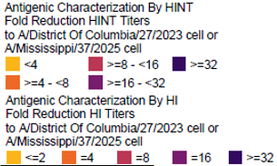{.thumb fig-alt="DC/27 thumbnail"}
:::

::: {.column width="75%"}
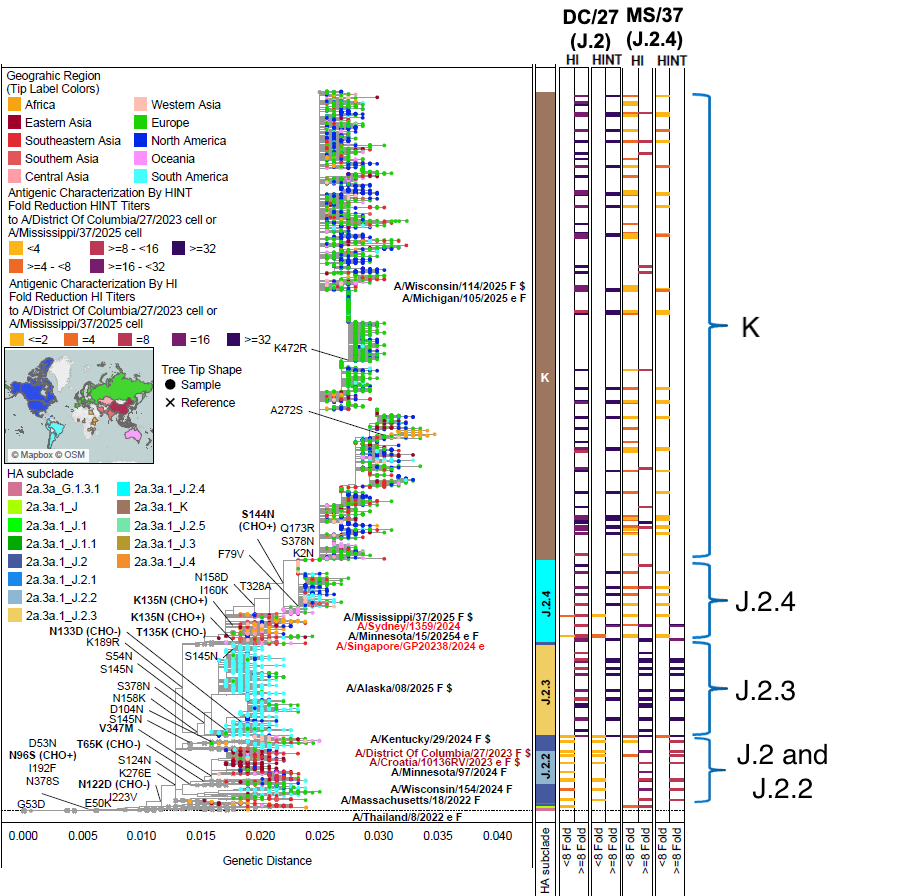{.clean-img fig-alt="Integrated genotype-phenotype phylogenetic tree" style="max-height: 580px; max-width: 100%; width: auto; height: auto; object-fit: contain;"}
:::
:::::

::: footnotes
Data source:  · [clades.nextstrain.org](https://clades.nextstrain.org/) · *Slide credit: Dr. Becky Kondor*
:::

::: notes
The image shown is an integrated analysis which includes a phylogenetic tree of the A(H3N2) HA gene with antigenic characterization results. The tree shows that the majority of circulating viruses express HA clade 2a.3a.1 from subclades K, J.2.4, and J.2.3. The heatmap on the integrated analysis shows that ferret antiserum raised against A/District of Columbia/27/2023, which belongs to subclade J.2, showed poor recognition to the majority of circulating viruses with the exception of those belonging to subclades J.2 and J.2.2. Ferret antiserum raised against A/Mississippi/37/2025, which belongs to subclade J.2.4, showed good recognition of K and J.2.4 viruses, reduced recognition to J.2 and J.2.2 viruses, and poor recognition of J.2.3 viruses.
:::

## A(H3N2) Circulating Subclades

-   Multiple subclades with additional HA substitutions co-circulating
-   Ferret antisera to **A/District of Columbia/27/2023 (J.2)** show *reduced to poor* reactivity with viruses from HA subclades **J.2.3, J.2.4 and K**
-   Ferret antisera to **A/Sydney/3549/2024-like (J.2.4)** show *reduced to poor* reactivity with viruses from HA subclade **J.2.3** but recognised most **J.2.4** viruses and many **K** viruses well

::::::::::::::::::::::: subclade-row
::::::: subclade-card
::: sc-title
<strong>A/District of Columbia/27/2023</strong>
:::

::: sc-sub
<em>2025 SH and 2025-26 NH Vaccine</em>
:::

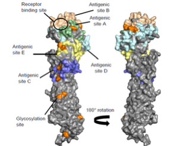

::: sc-clade
<strong>J.2</strong>
:::

::: emerged
:::
:::::::

::::::: subclade-card
::: sc-title
 
:::

::: sc-sub
 
:::

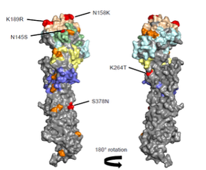

::: sc-clade
<strong>J.2.3</strong>
:::

::: emerged
Emerged Fall 2024
:::
:::::::

::::::: subclade-card
::: sc-title
<strong>A/Sydney/3549/2024</strong>
:::

::: sc-sub
<em>2026 SH Vaccine</em>
:::

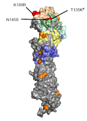

::: sc-clade
<strong>J.2.4</strong>
:::

::: emerged
Emerged Summer 2024
:::
:::::::

::::::: subclade-card
::: sc-title
<strong>A/Darwin/1415/2025</strong>
:::

::: sc-sub
<em>2026-27 NH Vaccine</em>
:::

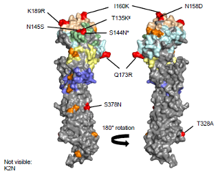

::: sc-clade
<strong>K</strong>
:::

::: emerged
Emerged Summer 2025
:::
:::::::
:::::::::::::::::::::::

::: footnotes
*Slide credit: Dr. Becky Kondor*
:::

::: notes
The images shown are A(H3N2) HA crystal structures of four representative viruses belonging to HA subclades J.2, J.2.3, J.2.4, and K. The first crystal structure is of A/District of Columbia/27/2023 (subclade J.2) representing the A(H3N2) components of the 2025 southern hemisphere and 2025-2026 northern hemisphere vaccine. The second crystal structure is of subclade J.2.3 viruses that first emerged in the fall of 2024. The third structure if of A/Sydney/3549/2024 (subclade J.2.4) representing the A(H3N2) component of the 2026 southern hemisphere vaccine. The fourth structure is of A/Darwin/1415/2025 (subclade K) representing the A(H3N2) component of the 2026-2027 northern hemisphere vaccine.
:::

## Influenza A(H3N2): antiviral susceptibility

::::::: columns
:::: {.column width="50%"}
::: {.callout-note title="Neuraminidase inhibitors" appearance="default"}
Of **4,458** influenza A(H3N2) viruses examined by genetic and/or phenotypic analyses, **two viruses** showed evidence of reduced susceptibility to NAIs; both had an **NA E119V** substitution.
:::
::::

:::: {.column width="50%"}
::: {.callout-warning title="Endonuclease inhibitors" appearance="default"}
Of **4,828** A(H3N2) viruses examined by genetic and/or phenotypic analyses, **nine viruses** showed evidence of reduced susceptibility to baloxavir marboxil:

-   3 had a **PA I38T** substitution
-   3 had a **PA I38I/T** substitution
-   2 had a **PA I38I/M** substitution
-   1 had a **PA E199E/G** substitution
:::
::::
:::::::

::: footnotes
[VCM Information meeting](https://www.youtube.com/@who) · *Slide credit: Dr. Becky Kondor*
:::

## Influenza A(H3N2) summary (1)

**Phylogenetics of A(H3N2) HA genes**

-   The vast majority of viruses belonged to one of the **J.2 subclades**, expressing HA **N122D** and **K276E** substitutions.
-   HA genes have diversified with many subclades:
    -   **J.2.2** — characterized by S124N
    -   **J.2.3** — characterized by N158K, K189R and S378N
    -   **J.2.4** — characterized by T135K (a potential loss of an N-glycosylation site) and K189R
    -   **K** — (formerly designated as J.2.4.1) characterized by K2N, S144N (a potential addition of an N-glycosylation site), N158D, I160K, Q173R, T328A and S378N
-   During this reporting period, **subclade K** viruses were detected in all regions and predominated in many countries.
-   There was still circulation of other J.2 subclades, notably **J.2 or J.2.3** in South America, **J.2.2 or J.2.4** in Africa and Asia.

::: footnotes
[VCM Information meeting](https://www.youtube.com/@who) · *Slide credit: Dr. Becky Kondor*
:::

## Influenza A(H3N2) summary (2)

**Antigenic characteristics of A(H3N2) viruses**

-   Post-infection ferret antisera raised against cell culture-propagated **A/District of Columbia/27/2023-like** and egg-propagated **A/Croatia/10136RV/2023-like** (clade 2a.3a.1, subclade J.2) viruses, representing the A(H3N2) component for the **NH 2025-2026** influenza vaccines, showed **poor recognition** with recently circulating subclade **J.2.3** (e.g., A/Netherlands/10685/2024), **J.2.4** (e.g., A/Sydney/1359/2024) and **K** (e.g., A/Darwin/1415/2025) viruses.
-   Ferret antisera raised against reference viruses from **J.2.3** subclades showed good recognition of viruses expressing HA from J.2.3, but poor recognition of other subclades.
-   Post-infection ferret antisera raised against cell culture-propagated **A/Sydney/1359/2024-like** and egg-propagated **A/Singapore/GP20238/2024-like** J.2.4 viruses, representing **SH 2026** influenza vaccines, recognised most J.2.4 viruses and many subclade K viruses well.
-   However, **subclade K** viruses and J.2.4 viruses with HA substitutions F79V, S144N (addition of a potential N-glycosylation site), N158D, I160K, T328A were better recognised by post-infection ferret antisera raised against cell culture-propagated **A/Darwin/1415/2025-like** and egg-propagated **A/Darwin/1454/2025-like** (subclade K) viruses.

::: footnotes
[VCM Information meeting](https://www.youtube.com/@who) · *Slide credit: Dr. Becky Kondor*
:::

## Influenza A(H3N2) summary (3)

**Human serology studies**

-   Human serology studies were conducted using the serum panels by **HI** and **virus neutralization (VN)** assays with recent circulating A(H3N2) viruses with HA genes from subclades **J.2, J.2.2, J.2.3, J.2.4, J.2.5 and K**.
-   When compared to titers against cell-propagated **A/District of Columbia/27/2023-like** vaccine reference viruses, post-vaccination HI GMTs or VN GMTs against many of the recent viruses in all subclades tested were **significantly reduced** in many serum panels.

::: {.callout-important title="Recommendation"}
The data supported recommending a cell-propagated **A/Darwin/1415/2025 (H3N2)-like (K)** virus and an egg-propagated **A/Darwin/1454/2025 (H3N2)-like (K)** virus as the A(H3N2) vaccine antigens for the **2026-2027 northern hemisphere**.
:::

::: footnotes
[VCM Information meeting](https://www.youtube.com/@who) · *Slide credit: Dr. Becky Kondor*
:::

## The analysis process never stops!

::: subtitle-line
**Goal** — To create CVVs of emerging subclades for cell-based and egg-based vaccines ahead of Vaccine Consultation Meetings
:::

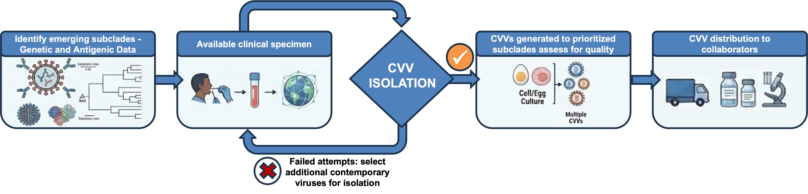

::: {.callout-tip title="Prioritization Process" appearance="simple"}
-   New CVVs are created as needed for each type/subtype
-   **Epidemiologic and Virologic surveillance data drives prioritization**
:::

::: footnotes
*Slide credit: Dr. Becky Kondor*
:::

## Specimens Received at CDC

::: subtitle-line
**February 1, 2025 to present**
:::

:::::: columns
::: {.column width="55%"}
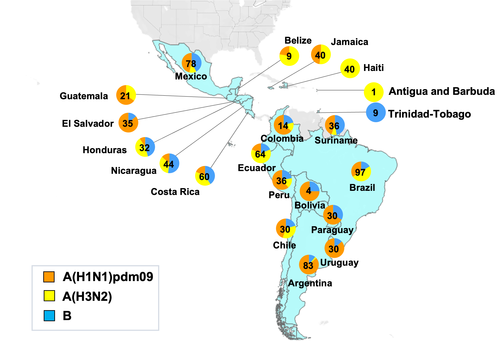{.clean-img fig-alt="Map of Latin America showing specimens received per country" style="max-height: 540px; max-width: 100%; width: auto; height: auto; object-fit: contain;"}
:::

:::: {.column width="45%"}
::: {.callout-note appearance="simple"}
Thank you for submitting influenza virus positive specimens to **WHO CC at CDC**. Your contributions ensure the best possible representation of circulating viruses to inform the recommendations for the composition of seasonal influenza vaccines and to analyze antiviral susceptibility.
:::

**CDC International Sender Reports**

-   **January 2026** — for shipments received through September 20, 2025
-   **April 2026** — for shipments received since October 1, 2025
::::
::::::

::: footnotes
*Slide credit: Dr. Becky Kondor*
:::

## Seasonal Influenza Specimen Shipping Guidelines for CDC {.smaller}

**CDC can support up to 4 shipments a year.** Please contact [InfluenzaVirusSurveillance\@cdc.gov](mailto:InfluenzaVirusSurveillance@cdc.gov) to initiate shipments.

::::: columns
::: {.column width="50%"}
**Recommended timing of shipments**

1.  One shipment ensuring receipt at CDC by **December 31, 2025** *(coincides with February VCM)*.
2.  One shipment ensuring receipt at CDC between **April and June 2026**.
3.  One shipment ensuring receipt at CDC by **August 1, 2026** *(coincides with September VCM)*.
4.  One shipment ensuring receipt at CDC between **October and November 2026**.
:::

::: {.column width="50%"}
**Ideal specimens**

-   Influenza positive and SARS-CoV-2 negative original clinical specimens
-   CT values **\< 28** for either InfA or InfB
-   **0.5 mL** volume
-   30 recently collected (\< 6 weeks)
    -   10 A(H1N1)pdm09
    -   10 A(H3N2)
    -   10 B/Victoria

:::
:::::

::: {.callout-warning appearance="simple"}
**Reminder** — if you have Influenza A Unsubtypeables, immediately contact [flusupport\@cdc.gov](mailto:flusupport@cdc.gov) to assist.
:::

::: footnotes
*Slide credit: Dr. Becky Kondor*
:::

## Thank you! {.thank-you}

:::::: columns
::: {.column width="55%"}
**CDC Influenza Division** · **CDC Traveler's Genomic Surveillance**

**US Public Health Laboratories**

-   National Influenza Reference Centers
-   APHL

**Global Influenza Surveillance and Response System**

-   National Influenza Centers
-   WHO CCs / ERL
-   WHO H5 Ref Labs
-   University of Cambridge
-   NextStrain
-   Previr
:::

:::: {.column width="45%"}
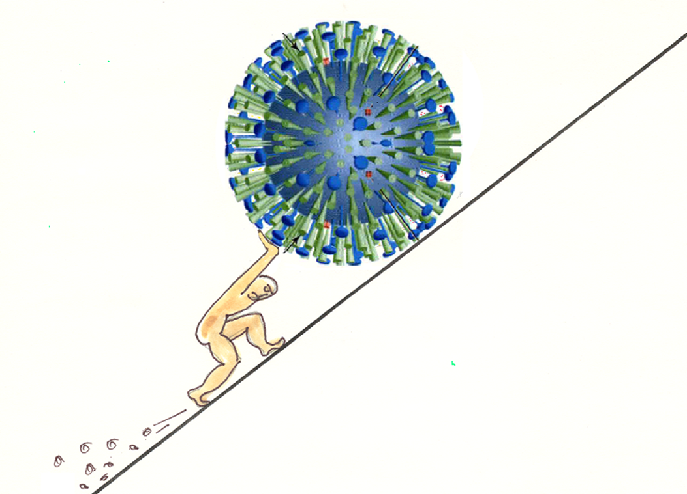{.clean-img fig-alt="Thank you decorative image"}

::: gisaid-ack
We gratefully acknowledge all data contributors, i.e., the **Authors** and their **Originating laboratories** responsible for obtaining the specimens, and their **Submitting laboratories** for generating the genetic sequence and metadata and sharing via the **GISAID Initiative**, on which this research is based.\

:::
::::
::::::
