## Learning Objectives {background-image="../assets/images/containers-objectives-slide.png" background-size="80%" background-position="center"}

By the end of this session, you will:

- Understand what software containers are
- Know why containers are important in bioinformatics
- Recognize common container registries

## The Problem {background-image="../assets/images/containers-problem.png" background-size="70%" background-position="center"}

Bioinformatics often involves:

- Predominantly linux-based tools
- Complex software stacks
- Conflicting dependencies
- Version mismatches
- "Works on my machine" issues

Result:

- Hard-to-reproduce analyses
- Time lost debugging environments

## What Is a Container? {background-image="../assets/images/containers-portable.png" background-size="50%" background-position="right bottom"}

A **container** is:

- A lightweight, portable environment
- Includes software, dependencies, and runtime

Think of it as:

> A self-contained package that runs the same anywhere.

## Containers vs Virtual Machines

:::: {.columns}

::: {.column width="40%"}
**Containers:**

- Lightweight
- Fast startup
- Share the host operating system kernel

**Virtual machines:**

- Heavier
- Full operating system per instance
- Slower startup


:::

::: {.column width="60%"}
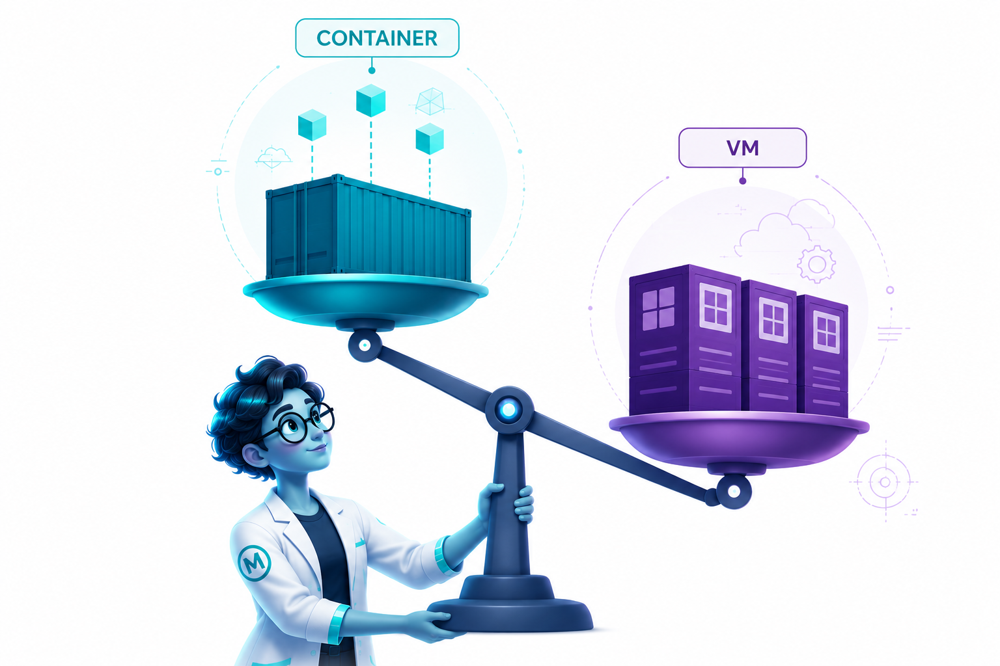
:::

::::

## Why Containers in Bioinformatics?

:::: columns
::: {.column width="40%"}
- Reproducibility across systems
- Easier sharing of tools and workflows
- Fewer dependency conflicts
- Usable on HPC, cloud, and local machines
:::
::: {.column width="60%"}
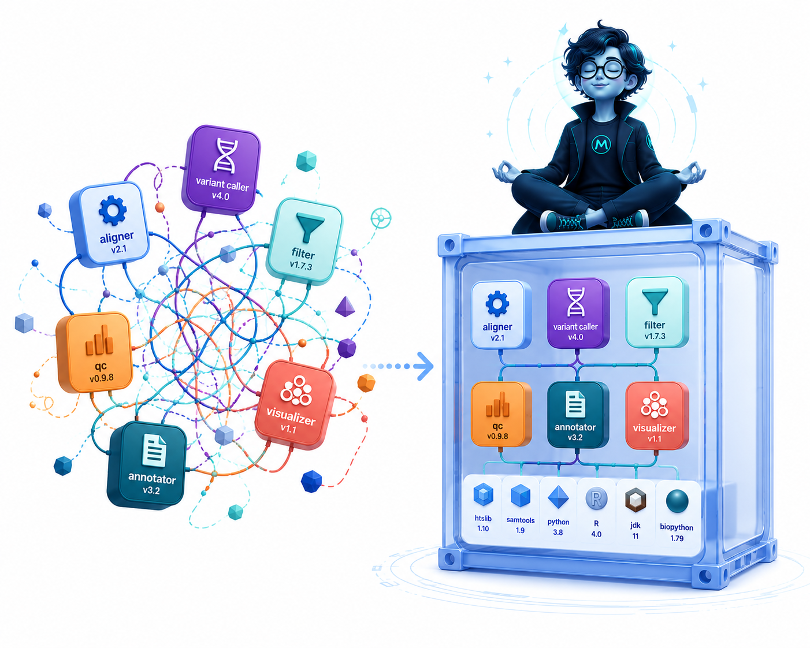
:::
::::
## Key Definitions

**Kernel** — the core of an operating system; manages processes, memory, files, networking, and hardware. Containers share the host's kernel, which is why they are lightweight. Linux containers need a Linux kernel (macOS/Windows use a hidden Linux VM).

**Daemon** — a background process that runs continuously, waiting for requests. Docker runs a daemon (`dockerd`); Podman and Apptainer are *daemonless* and run containers directly.

**Runtime** — the software that actually starts and runs a container.

- **High-level runtime** (e.g., containerd) — manages the full lifecycle: pulling images, storage, networking, then delegates to a low-level runtime
- **Low-level runtime** (e.g., runc, crun, Apptainer runtime) — talks to the kernel to create the isolated container process

## Core Components of a Container System

:::: {.columns}

::: {.column width="50%"}
**Container Engine** — user-facing CLI/API

- Docker, Podman, Apptainer

**High-level Runtime** — daemon managing lifecycle (pull, store, run)

- containerd (used by Docker), Podman (daemonless)

**Low-level Runtime** — spawns the actual container process

- runc, crun, Apptainer runtime

**Linux VM layer** (macOS/Windows only)

- Lima, Docker Desktop VM, Podman Machine, WSL2
- Provides the Linux kernel containers need

:::

::: {.column width="50%"}
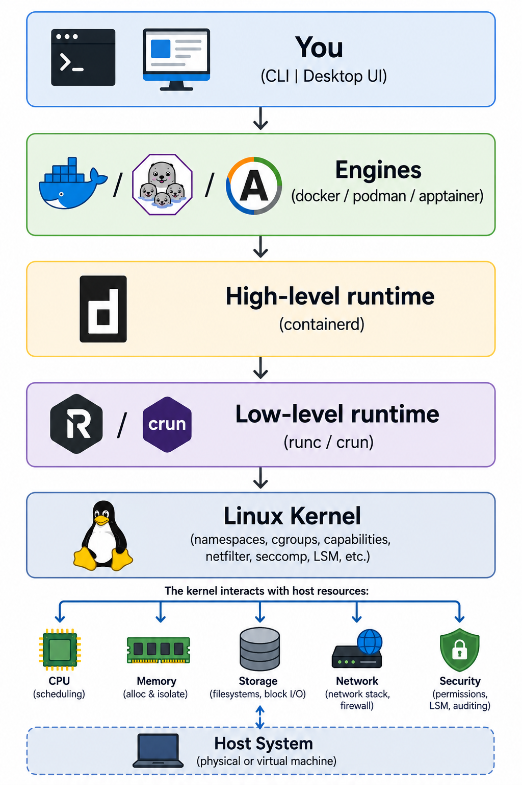{width="60%"}
:::

::::


## Images vs Containers

:::: {.columns}

::: {.column width="40%"}
- **Image** = blueprint, binary snapshot 
- **Container** = running instance of an image

::: {.callout-tip}
You *run* containers from images.
:::
:::

::: {.column width="60%"}
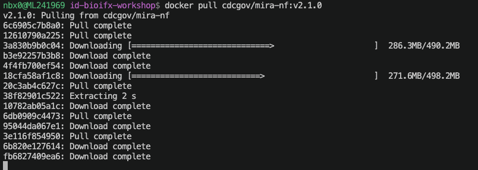
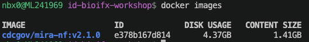
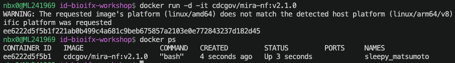
:::

::::

## Popular Container Tools

:::: {.columns}

::: {.column width="40%"}
- **Docker**
  - Requires root (admin) access
- **Podman**
  - Rootless "drop-in" replacement for Docker
- **Singularity / Apptainer**
  - Designed for HPC
  - Works on shared systems
:::

::: {.column width="70%"}
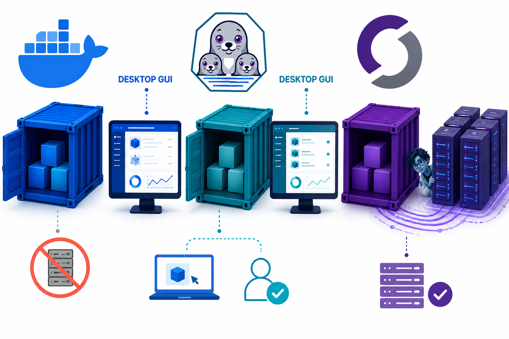
:::

::::

## The Open Container Initiative (OCI)

The **OCI** defines open standards for containers:

- **Image Spec** — how images are built
- **Runtime Spec** — how containers run
- **Distribution Spec** — how registries share images

Why it matters:

- The same image works across Docker, Podman, and Apptainer
- No vendor lock-in
- Apptainer can pull images from Docker Hub because they all follow OCI

Be cautious of non-OCI formats:

- Singularity-only `.sif` files with no OCI source — hard to audit or rebuild
- Tarball "containers" with no manifest or recipe
- VM images (`.ova`, `.vmdk`) — these are virtual machines, not containers

## You find container images on **container registries**

A **container registry** is a storage location for container images.

- Share tools easily
- Access pre-built environments
- Version control for software stacks
- Support reproducible workflows

:::: {.columns}

::: {.column width="25%"}
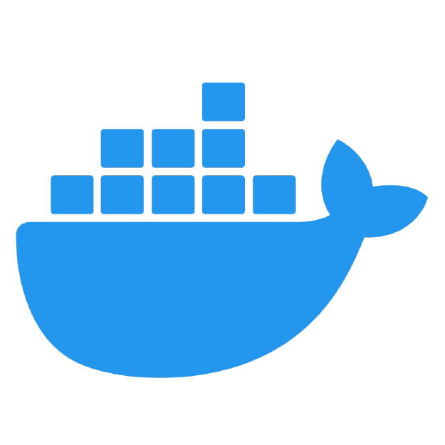
:::

::: {.column width="25%"}

:::

::: {.column width="25%"}
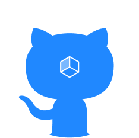
:::

::: {.column width="25%"}

:::

::::

## Typical Workflow

:::: columns

::: {.column width="50%"}
1. Find a container in a registry
2. Pull or download the image
3. Run analysis using the container

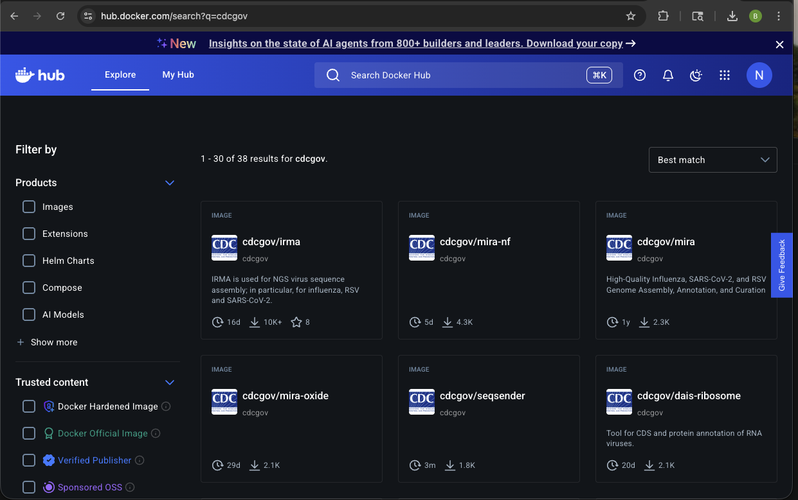
:::
::: {.column width="50%"}


:::
::::

## How Containers Run

**Ephemeral** (most common in bioinformatics)

- Container starts, runs a task, then is automatically removed
- `docker run --rm` — the `--rm` flag deletes the container when it exits
- Ideal for pipelines: each step gets a fresh, clean environment

**Interactive**

- You get a shell inside the container to explore or debug
- `docker run -it ubuntu bash` — opens a terminal session inside the container
- Useful for testing tools, inspecting files, or troubleshooting

**Background (detached)**

- Container runs as a long-lived service (e.g., a database or web server)
- `docker run -d nginx` — starts the container and returns you to your terminal
- Less common in bioinformatics, but used for shared services like Galaxy or JupyterHub

## Workflow Integration

:::: {.columns}

::: {.column width="40%"}
Containers are standard in modern pipelines:

- Nextflow
- Snakemake
- CWL / WDL

**Nextflow** automatically pulls containers and runs each step in its own environment.
:::

::: {.column width="60%"}
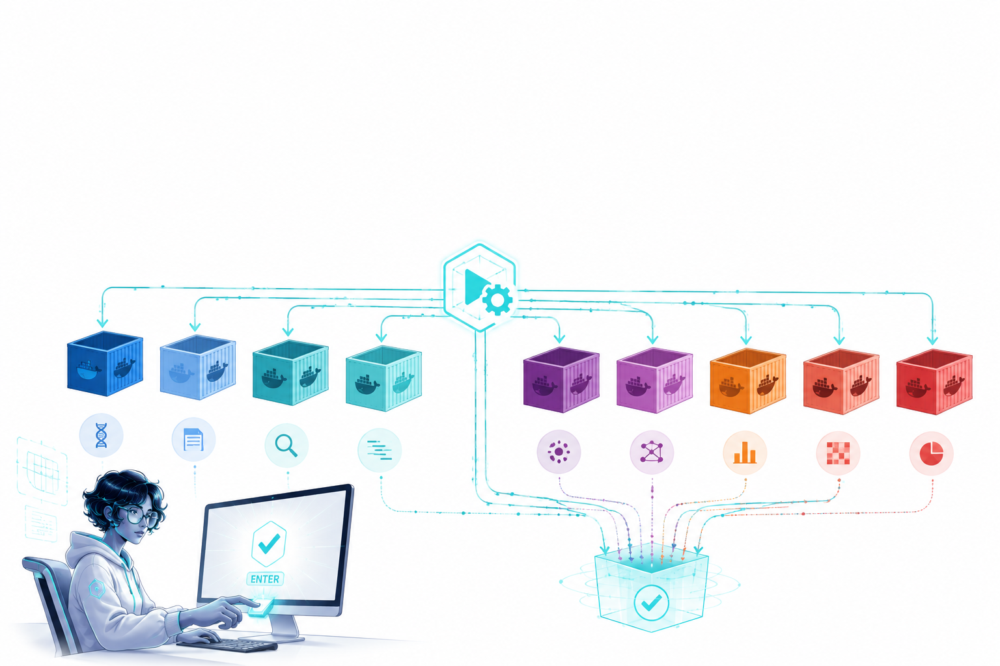
:::

::::

## Versioning

Images are tagged, for example:

  - `cdcgov/mira-nf:v2.1.1`
  - `cdcgov/irma-core:v0.9.1`
  - `cdcgov/IRMA:v1.3.2`
  - `cdcgov/DAIS-ribosome:v1.7.0`
  - `cdcgov/mira-oxide:v1.5.4`
  - `cdcgov/nextclade:v3.21.2`

::: {.callout-warning}
**Avoid `latest` — pin a specific version for reproducible work.**
:::

## Container Security Matters

:::: {.columns}

::: {.column width="55%"}
Why think about security?

- Containers can run arbitrary code
- Images may include unknown or outdated software
- Risks are higher in shared environments such as HPC or cloud systems

::: {.callout-important}
Treat containers like executable software.
:::
:::

::: {.column width="45%"}
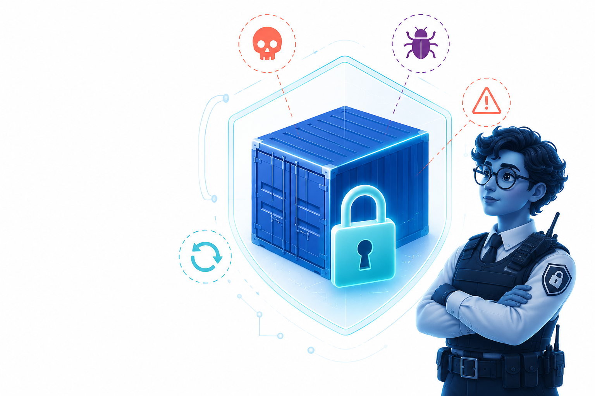
:::

::::

## Use Trusted Sources

Good sources:

- Official tool images
- BioContainers
- CDCgov Docker Hub

::: {.callout-important}
Look for clear versioning, documentation, and active maintenance.
:::
Red flags:

- No documentation
- Only `latest` tags
- Unknown publishers
- Images requiring unnecessary privileges

## Root vs Rootless Containers

:::: {.columns}

::: {.column width="55%"}
**Root** (default Docker): elevated privileges; risky on shared systems.

**Rootless:**

- **Podman** — rootless by default; drop-in replacement for Docker commands
- **Apptainer** — rootless by design; runs containers as simple user-space processes

HPC systems usually restrict root access — this is why Apptainer and Podman are preferred in research computing.
:::

::: {.column width="45%"}
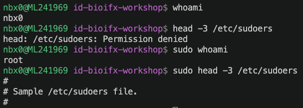
:::

::::

## Best Practices for Users

- Use trusted registries, such as CDCgov Docker Hub or BioContainers
- Prefer rootless on shared systems
- Pin versions
- Avoid `latest` tags in workflows
- Be cautious with unknown images
- Understand where your data are mounted: `--volume` or `-v` flags

## Example: Docker and Apptainer

:::: {.columns}

::: {.column width="55%"}
Run a trusted container with **Docker**:

```{.bash code-line-numbers="true"}
docker run \
--rm \                           
 -v ${PWD}:/data \                    
 cdcgov/mira-nf:v2.1.1 \              
 nextflow run /MIRA-NF/main.nf \      
     -profile mira_nf_container \     
     --input /data/samplesheet.csv \  
     --runpath /data \                
     --outdir /data/mira-output \     
     --e Flu-Illumina \               
     --nextclade true                 
```
:::

::: {.column width="45%"}
#### Lines:
1. Run a container
2. Remove it after it exits with `--rm`
4. Run as your user ID — avoids root-owned output files
5. Mount the current directory into `/data` inside the container
5. Pinned image version from CDCgov Docker Hub
6. Execute the MIRA-NF Nextflow pipeline inside the container
7. -12 Pipeline arguments: samplesheet, input/output paths, assay type, and Nextclade flag
:::

::::

## Summary

- **Containers** — reproducibility, portability, ease of use
- **Registries** — access, sharing, versioning
- **Security** — use trusted sources, pin versions, prefer rootless

Do not install everything manually. Use **trusted, secure containers**.

## Questions

**Questions?**
